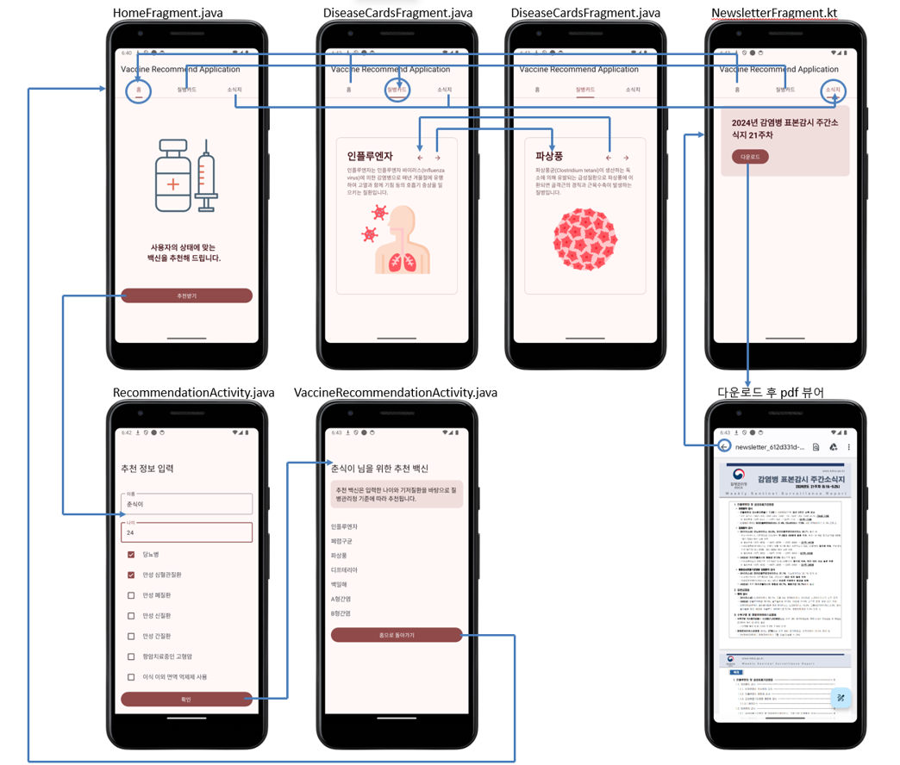
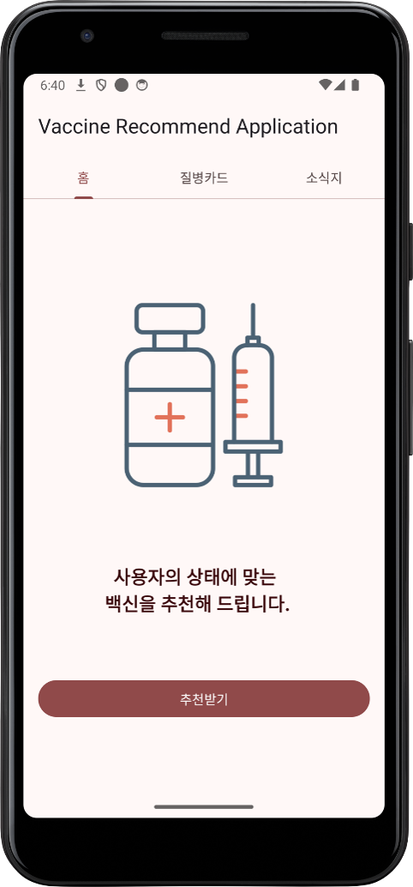
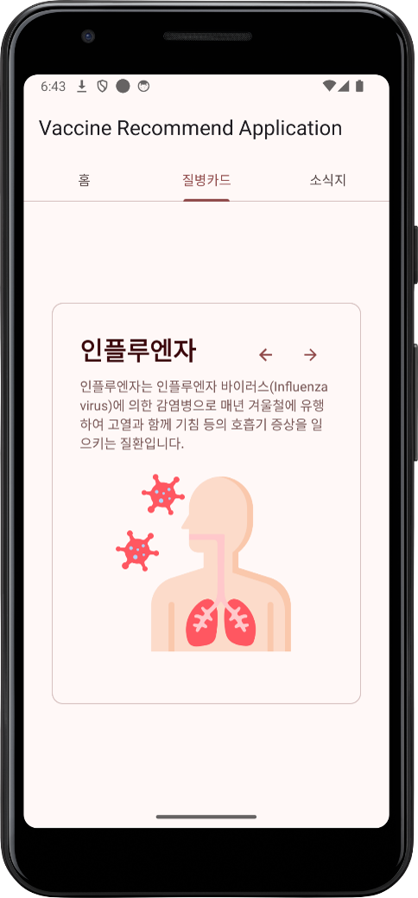
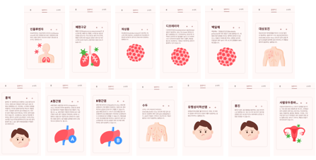
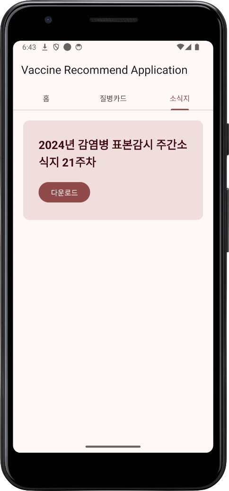
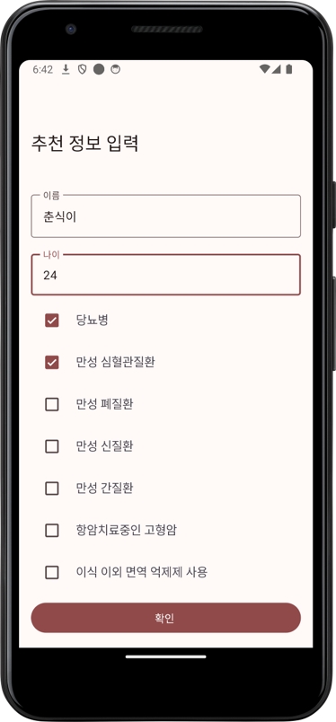
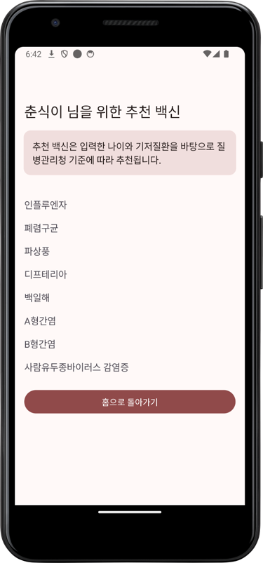

# 백신 추천 애플리케이션

- ✅ 효율적인 필터링 로직으로 백신 추천 시스템 구현  
- ✅ 직관적이고 사용하기 쉬운 인터페이스 설계  
- ✅ 최신 감염병 정보를 손쉽게 접근 가능 

## 서비스 소개

백신 추천 애플리케이션은 사용자의 나이, 건강 상태 등 주요 정보를 바탕으로 맞춤형 백신을 추천해주는 안드로이드 기반 애플리케이션입니다. 또한, 다양한 질병 정보와 감염병 관련 최신 소식지를 제공하여 사용자가 건강 관리를 쉽게 할 수 있도록 돕습니다.

이번 프로젝트에서 백신 추천 애플리케이션을 개발하며, 예방 접종의 중요성을 사용자들에게 알리고 맞춤형 정보를 제공하고자 했습니다. 간단한 사용자 입력만으로 신뢰할 수 있는 추천 정보를 제공하며, 특히 면역력이 약한 노인, 만성 질환 환자, 예방 접종 정보를 찾는 사용자들에게 유용하게 활용될 수 있습니다.

---

## 와이어프레임 및 화면 구성

  

### 1. 메인 화면

### 2. 질병 카드 화면

  
  

### 3. 소식지 화면

### 4. 추천 정보 입력 화면

### 5. 백신 추천 결과 화면

---

## 목차
1. 🚀 [주요 기능](#주요-기능)
   - [🌟 핵심 기능](#핵심-기능)
2. ⚙️ [기술적 세부 사항](#기술적-세부-사항)
   - [📂 데이터베이스 설계](#데이터베이스-설계)
   - [🔄 데이터 흐름](#데이터-흐름)
3. 👥 [팀 역할 분담](#팀-역할-분담)

---

## 주요 기능

### 🌟 핵심 기능
1. **백신 추천 시스템**  
   - 사용자가 입력한 나이와 건강 상태를 기준으로 맞춤형 백신을 추천합니다.
   - **구성 요소**:  
     🔹 **Disease Model**:  
     연령 필터와 금기 질환 정보를 이진값(Binary)으로 저장하여 필터링 효율성을 높임.  
     🔹 **RecommendationService**:  
     입력 데이터를 바탕으로 필요한 백신을 계산.  
   - 데이터를 빠르게 처리하고 접근할 수 있도록 `DiseaseRepository`를 활용했습니다.

2. **질병 카드 시스템**  
   - 다양한 질병 정보를 카드 형식으로 제공하며, 좌우 스와이프로 편리하게 탐색할 수 있습니다.  
   - SVG 포맷 이미지를 처리하기 위해 `GlideToVectorYou` 라이브러리를 활용했습니다.

3. **소식지 다운로드 기능**  
   - 최신 감염병 관련 소식지를 다운로드할 수 있습니다.  
   - Android `DownloadManager`와 `CoroutineScope`를 사용하여 비동기 작업을 구현했습니다.  
   - 다운로드 완료 시 알림과 함께 기본 파일 리더로 소식지를 열 수 있습니다.

4. **UI 네비게이션**  
   - 사용자 친화적인 화면 전환과 네비게이션을 제공합니다.  
   - **구성 요소**:  
     🔹 `ViewPager`와 `TabLayout`을 활용해 여러 페이지를 손쉽게 탐색 가능.  
     🔹 `Intent`를 통해 액티비티 간 데이터 전달을 효율적으로 처리했습니다.

---

## 기술적 세부 사항

### 📂 데이터베이스 설계
- **Disease Model**  
  각 질병의 접종 권장 연령과 금기 질환 정보를 이진값으로 저장해 필터링 과정에서 계산 효율을 높였습니다.  
  - **예시**:  
    - 권장 연령 필터: `ageFilter`  
    - 금기 질환 필터: `forbiddenHealthConditionFilter`

- **Disease Database**  
  SQLite 기반 데이터베이스로, 초기 실행 시 필수 데이터를 미리 삽입합니다.  
  데이터는 `DiseaseRepository`를 통해 관리하며, 질병 정보 조회 및 필터링에 활용됩니다.

---

### 🔄 데이터 흐름
1. **입력 단계**  
   사용자가 `RecommendationActivity`에서 정보를 입력합니다.  
2. **데이터 처리 단계**  
   입력된 데이터는 `Intent`를 통해 `VaccineRecommendationActivity`로 전달됩니다.  
3. **결과 표시 단계**  
   `RecommendationService`가 데이터를 분석하고 결과를 화면에 표시합니다.

---

## 팀 역할 분담

### 👤 **이진솔**
- 🎨 **UI/UX 디자인**:  
  Jetpack Library(ViewPager, Fragment)를 활용한 화면 이동 및 네비게이션 구현  
- 🖌️ **사용자 인터페이스 설계**:  
  각 페이지의 사용자 인터페이스 설계  
- 🏗️ **페이지 레이아웃 구성**:  
  각 화면의 레이아웃 설계 및 구현  
- 🔄 **데이터 전달 구현**:  
  Activity 간 데이터 전달을 위한 Intent 기능 구현  
- 📄 **발표 자료 정리**

### 👤 **성형주**
- 📊 **데이터 처리 및 연동**:  
  SQLite 데이터베이스 설계 및 연동  
- 🌐 **외부 데이터 연동**:  
  외부 서버에서 이미지 파일 다운로드 구현  
- 🧠 **백신 추천 알고리즘**:  
  추천 서비스 개발 및 최적화  
- 📄 **발표 자료 작성**

